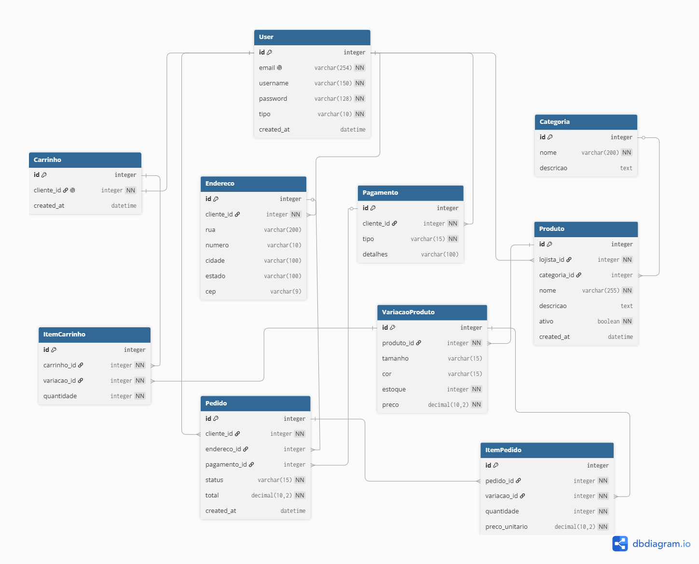

# NewStyle API


> API REST para um e-commerce de roupas, desenvolvida com Django REST Framework. A plataforma funciona como um marketplace, permitindo que lojistas gerenciem seus produtos e que clientes naveguem pelo catálogo, montem carrinhos e realizem pedidos.

Projeto desenvolvido como desafio do processo seletivo de trainee de Backend da **Eject - Empresa Júnior da Escola de Ciências e Tecnologia da UFRN**.

---

## Índice

- [Sobre o projeto](#sobre-o-projeto)
- [Funcionalidades](#funcionalidades)
- [Tecnologias](#tecnologias)
- [Modelagem de dados](#modelagem-de-dados)
- [Instalação e execução](#instalação-e-execução)
- [Documentação da API](#documentação-da-api)
- [Principais endpoints](#principais-endpoints)
- [Aprendizado e referências](#aprendizado-e-referências)
- [Autor](#autor)

---

## Sobre o projeto

A NewStyle API é o backend de um serviço de e-commerce de roupas. Ela oferece toda a lógica de negócio necessária para uma loja virtual funcional, com dois tipos de usuário:

- **Lojista**: responsável por cadastrar e gerenciar produtos, variações e estoque, além de visualizar e atualizar o status dos pedidos que contêm seus produtos.
- **Cliente**: navega pelo catálogo, gerencia seu carrinho, cadastra endereços e métodos de pagamento, e finaliza compras.

A API foi construída seguindo os casos de uso definidos pela Eject, com foco em segurança (autenticação JWT, criptografia de senha), boas práticas de modelagem e regras de negócio bem definidas.

---

## Funcionalidades

- **Autenticação JWT**: cadastro, login e renovação de token
- **Recuperação de senha**: via envio de email com token seguro de uso único
- **Gerenciamento de produtos**: CRUD completo restrito ao lojista dono
- **Variações e estoque**: controle de estoque por variação (tamanho + cor)
- **Navegação e busca**: listagem de produtos com filtros por categoria e busca por texto
- **Carrinho de compras**: com validação de estoque e regra de lojista único
- **Realização de pedidos**: finalização com transação atômica e baixa de estoque
- **Gerenciamento de pedidos (lojista)**: atualização de status e filtro
- **Métodos de pagamento**: CRUD com mascaramento de dados sensíveis
- **Email de contato**: endpoint público para mensagens à plataforma
- **Documentação interativa**: Swagger/OpenAPI

---

## Tecnologias

- **Python 3**
- **Django**: framework web
- **Django REST Framework**: construção da API REST
- **Simple JWT**: autenticação via JSON Web Tokens
- **drf-spectacular**: geração automática da documentação Swagger
- **django-filter**: filtros de busca nos endpoints
- **python-decouple**: gerenciamento de variáveis de ambiente
- **SQLite**: banco de dados
- **PythonAnywhere**: hospedagem (deploy)

---

## Modelagem de dados

O diagrama abaixo representa as entidades do sistema e seus relacionamentos:



### Principais entidades

| Entidade | Descrição |
|----------|-----------|
| **User** | Usuário do sistema, com papel de lojista ou cliente |
| **Categoria** | Categoria de produtos |
| **Produto** | Produto cadastrado por um lojista |
| **VariacaoProduto** | Variação de um produto (tamanho, cor, estoque e preço) |
| **Carrinho / ItemCarrinho** | Carrinho do cliente e seus itens |
| **Pedido / ItemPedido** | Pedido finalizado e seus itens |
| **Endereco** | Endereços de entrega do cliente |
| **Pagamento** | Métodos de pagamento do cliente |

---

## Instalação e execução

Siga os passos abaixo para rodar o projeto localmente.

### 1. Clone o repositório

```bash
git clone https://github.com/jvguimaraess/NewStyle-API.git
cd NewStyle-API
```

### 2. Crie e ative o ambiente virtual

```bash
# Windows
python -m venv venv
venv\Scripts\activate

# Linux / Mac
python3 -m venv venv
source venv/bin/activate
```

### 3. Instale as dependências

```bash
pip install -r requirements.txt
```

### 4. Configure as variáveis de ambiente

Crie um arquivo `.env` na raiz do projeto com o seguinte conteúdo:

```env
SECRET_KEY=sua-secret-key
DEBUG=True
EMAIL_HOST_USER=seu-email@gmail.com
EMAIL_HOST_PASSWORD=sua-senha-de-app
FRONTEND_URL=http://localhost:8000
```

> A `EMAIL_HOST_PASSWORD` deve ser uma **senha de app** do Gmail, não a senha normal da conta.

### 5. Rode as migrações

```bash
python manage.py migrate
```

### 6. Crie um superusuário (opcional, para acessar o admin)

```bash
python manage.py createsuperuser
```

### 7. Inicie o servidor

```bash
python manage.py runserver
```

A API estará disponível em `http://127.0.0.1:8000/`.

---

## Documentação da API

A documentação interativa (Swagger) está disponível e permite visualizar e testar todos os endpoints.

- **Local:** `http://127.0.0.1:8000/api/docs/`
- **Produção:** [https://jvguimaraeseject.pythonanywhere.com/api/docs/](https://jvguimaraeseject.pythonanywhere.com/api/docs/)

Para acessar endpoints protegidos, faça login, copie o `access` token retornado e autorize no botão **Authorize** do Swagger no formato `Bearer <token>`.

---

## Principais endpoints

### Autenticação

| Método | Endpoint | Descrição |
|--------|----------|-----------|
| `POST` | `/api/auth/register/` | Cadastro de usuário |
| `POST` | `/api/auth/login/` | Login (retorna tokens JWT) |
| `POST` | `/api/auth/token/refresh/` | Renova o access token |
| `POST` | `/api/auth/forgot-password/` | Solicita recuperação de senha |
| `POST` | `/api/auth/reset-password/` | Redefine a senha com token |

### Produtos e variações

| Método | Endpoint | Descrição |
|--------|----------|-----------|
| `GET` | `/api/products/` | Lista produtos (com filtros e busca) |
| `POST` | `/api/products/` | Cria produto (lojista) |
| `GET` | `/api/products/{id}/` | Detalha um produto |
| `PUT` | `/api/products/{id}/` | Atualiza produto (lojista) |
| `DELETE` | `/api/products/{id}/` | Remove produto (lojista) |
| `POST` | `/api/variacoes/` | Cria variação de produto (lojista) |

### Carrinho

| Método | Endpoint | Descrição |
|--------|----------|-----------|
| `GET` | `/api/itens-carrinho/` | Lista itens do carrinho |
| `POST` | `/api/itens-carrinho/` | Adiciona item ao carrinho |
| `DELETE` | `/api/itens-carrinho/{id}/` | Remove item do carrinho |

### Pedidos

| Método | Endpoint | Descrição |
|--------|----------|-----------|
| `POST` | `/api/orders/finalizar/` | Finaliza a compra a partir do carrinho |
| `GET` | `/api/orders/` | Lista pedidos (com filtro por status) |
| `PATCH` | `/api/orders/{id}/atualizar_status/` | Atualiza status (lojista) |

### Endereços e pagamentos

| Método | Endpoint | Descrição |
|--------|----------|-----------|
| `GET` `POST` | `/api/enderecos/` | Lista e cria endereços do cliente |
| `GET` `POST` `DELETE` | `/api/payments/` | Gerencia métodos de pagamento |

### Contato

| Método | Endpoint | Descrição |
|--------|----------|-----------|
| `POST` | `/api/contact/email/` | Envia mensagem de contato |

---

## Aprendizado e referências

Este projeto foi desenvolvido em paralelo com o estudo das tecnologias envolvidas. As principais fontes utilizadas foram:

- **Alura**: curso de Python aplicando Orientação a Objetos e Django REST Framework
- **Udemy**: Curso de Django REST Framework
- **Documentação oficial do Django REST Framework**: https://www.django-rest-framework.org
- Artigos de apoio sobre boas práticas de modelagem e custom user models no Django

Durante o desenvolvimento, utilizei a IA **Claude (Anthropic)** como ferramenta de tutoria para esclarecer conceitos, revisar código e orientar decisões técnicas. Todo o código foi escrito, compreendido e testado por mim, com a IA atuando como apoio ao aprendizado, e não como gerador automático da solução.

---

## Autor

**João Vitor Guimarães Albarello**

Desenvolvido como parte do processo seletivo de trainee de Backend da Eject UFRN.
